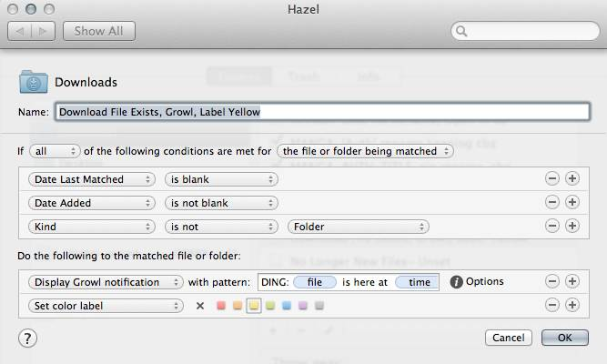

# SDDD ("Super Dumb Download Done") #

SDDD is a Hazel rule for use in ~/Downloads folder to notify you: "Download Done". 

## Why?

Do you like staring at Download progress? Neither do I. If you have better things to do, but still want to know when a Download is 'done' this is for you.

Because I miss 'SafariGrowl' and Chrome doesn't notify either. This method doesn't work for Firefox, but if you need the functionality there try the Firefox extension "Growl GNTP" which works with Firefox 20, even on Mac.

Using a last 'any file' rule is problematic. Why? Unzip file. DING. Move into folder. DING. Oh wow! A folder! DING. 

Using this rule, it should catch any file being 'created' via browser Download and *then* just go DING.

## Requires

Hazel, tested with 3.0.18
Growl, tested with 2.0.1

## Usage

- Download the rule
- Import into Hazel, meant for your Download folder
- Make sure the rule is LAST in the chain of other rules. This is meant to replace, or come before the normally last 'any file' rule.
- Enjoy

### Tips

- You don't need to add 'Kind is not Application' or any conditions like that, because Applications are Folders. Adding Applications breaks the workflow.

- If you use a 'bulk downloader' save *those files* to another folder & save yourself some grief. Growl & Notification Center both have 'flood control' but don't push it.

- Use this with Prowl or Boxcar. Download OSX Combo Update. Go out for coffee. DING. Your download is done, either remote into the machine and do things, or head home. With coffee.

### Workarounds

For those not using Growl:

If you're using 10.8's Notification Center the 'Display Growl Notification' rule may not be there. Under 'Do the Following' just add 'Display Notification' instead, and re-fill the strings to your liking.

### Warranties

NONE. This was cooked up in about an hour. Use as thou wilt.

